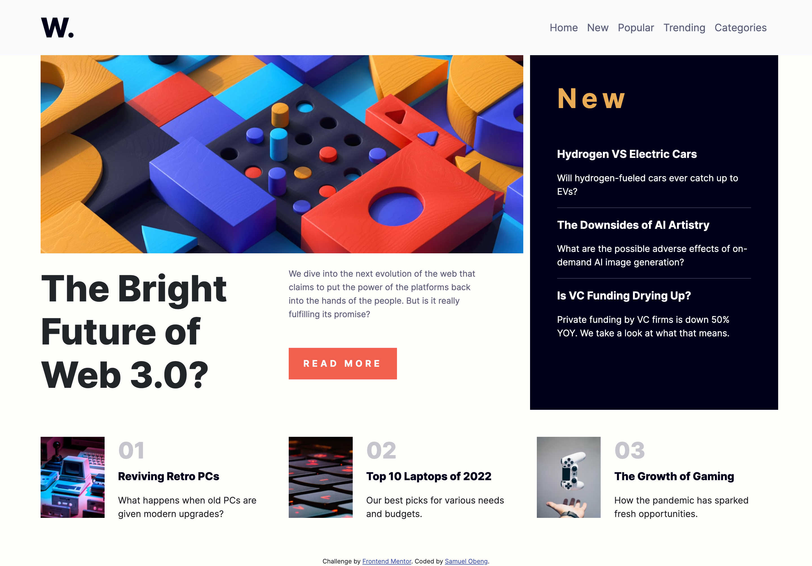

# Frontend Mentor - News homepage solution

This is a solution to the [News homepage challenge on Frontend Mentor](https://www.frontendmentor.io/challenges/news-homepage-H6SWTa1MFl). Frontend Mentor challenges help you improve your coding skills by building realistic projects. 

## Table of contents

- [Overview](#overview)
  - [The challenge](#the-challenge)
  - [Screenshot](#screenshot)
  - [Links](#links)
- [My process](#my-process)
  - [Built with](#built-with)
  - [What I learned](#what-i-learned)
  - [Continued development](#continued-development)
- [Author](#author)


**Note: Delete this note and update the table of contents based on what sections you keep.**

## Overview

### The challenge

Users should be able to:

- View the optimal layout for the interface depending on their device's screen size
- See hover and focus states for all interactive elements on the page
- **Bonus**: Toggle the mobile menu (requires some JavaScript)

### Screenshot




### Links

- Solution URL: https://github.com/samlobeng/news-homepage.git
- Live Site URL:https://samlobeng.github.io/news-homepage/

## My process

### Built with

- Semantic HTML5 markup
- CSS custom properties
- Flexbox
- CSS Grid
- Desktop-first workflow
- Bootstrap 5.2

### What I learned

I learned bootstrap grid system and various bootstrap utility classes. I learned how to use various bootstrap components like navbar.
I also learned about complex css selectors.
```css
.description p:first-of-type{
    color: hsl(240, 100%, 5%);
    font-weight: 800;
    font-size: 1.2rem;
}
.description p:first-of-type:hover{
   color: hsl(5, 85%, 63%);
   cursor: pointer;
   transition: color .3s;
}
```

### Continued development

I want to continue to understand the mobile first design system.

## Author

- Website - [Samuel Obeng](https://samlobeng.github.io/sob-portfolio/)
- Frontend Mentor - [@samlobeng](https://www.frontendmentor.io/profile/samlobeng)
- Twitter - [@S_ObengGh](https://www.twitter.com/S_ObengGh)

